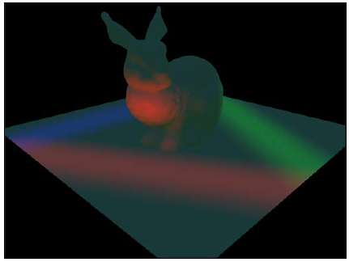
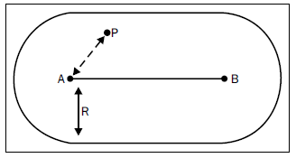

# 简介

## 本章概括
* 半球形环境光源
* 方向光源
* 点光源
* 聚光源
* **胶囊光**
* 投影纹理-点光源
* 投影纹理-聚光源
* **多光源情况**

## 介绍

前向光照是一个非常常规的方法在计算不同光源和场景中其他元素相互作用时，例如网格和特效。前向光照方法已经存在从固定管线时期（当时可编程着色器还是一个梦想）直到实现可编程着色器的今天。

一个高级的观点，这个方法工作通过每绘制一个网格需要枚举一次场景中光源。每一个draw call光源通过添加颜色值来点亮最终显示在屏幕上的图片。性能方面，他是非常昂贵的-一个场景有N个光源和M个网格，我们将需要调用N×M次draw call。提高性能有不同的方法，下面的列包含了四大常用的优化：
* 使用所有完全不透明的网格来预热深度缓冲区。（这个方法不会浪费资源，不会在渲染像素时被离相机更近的像素重写）
* 渲染场景中相机时，跳过不可见的光源和场景元素。
* 做边界测试，计算哪个光源影响到哪个网格。基于这个结果，如果光源或网格不相交，跳过他们的draw call。
* 把影响到同一个网格的多个光源合并到单次draw call里，这个方法减少了draw call的次数和开销，但是需要预先准备网格的光照信息。

场景的深度渲染，上面提到的第一种方法，能非常简单的实现，只要要求shader输出深度值即可。第二和第三中方法的实现在CPU，所以我们就不在本书讨论。第四种方法的解释将在本章的最后。由于每一种方法偶是相互独立的，推荐一起使用以提高综合性能。

由于延迟光照和**平铺光照（烘焙？）** 性能方面的提升，前向光照最近这几年不再受欢迎（将在下一章介绍），但明白其如何工作仍然是非常重要的，有下面几个原因：
* 前向光照能完美的照亮场景里不完全透明的元素。实际上延迟光照方法只能拿到不透明的元素，这意味着前向光照方法仍然被需要包含半透明元素的场景中。
* 前向光照在低质量渲染时执行得更好，例如低分辨率反射图。
* 在原型设计和实时性能不重要的情况下，前向光照能更简单的照亮一个场景。

用于渲染的高级着色器语言覆盖了下面所有的秘诀，这意味着读者们将需要明白怎样去做下面几件事情：
* 编译和加载shaders
* 准备能加载和管理场景的一个系统
* 准备一个支持Direct3D draw call的shader渲染框架

使用这项技术的全部顶点缓冲必须包含位置和法线信息。为了达到平滑的结果，使用平滑的顶点法线（应该避免表面法线）。

注意，这个像素着色器必须为每一个网格提供一个像素值。每个网格的颜色值可能是一个常数或者采样来至一个纹理。

## 半球形环境光
环境光是最容易实现的光照模型，但是它对场景的整体外观感受非常的重要。更多的情况，环境光指的是场景中的任意光源，它不直接与特定的光源关联。这个定义是非常灵活的,它的实现一会将展示。

在过去，场景中每一个网格都使用一个常量的颜色值得到一个扁平的结果。随着可编程着色器变成可能，程序员从常量颜色值到把网格法线考虑进去从而避免扁平外观的解决方案。半球形光照是一个常规的做法在实现环境光方面，他把法线考虑进去从而不需要许多的计算，下面的截图显示了相同的网格通过常量环境颜色值（左边）和半球形环境光照（右边）渲染的对比。


你能够看到，常量环境光隐藏了网格所有的细节，而半球形环境光提供了更多详细的结果。

### 准备工作
半球形环境光在渲染时需要两种颜色来表现来自每个网格上面和下面的光线。我们将使用一个常量缓冲区来把颜色值传给像素着色器。使用下面的值来填充D3D11_BUFFER_DESC对象：


这个描述符字段应该重置为0.

创建一个实际的缓冲区，它保存一个ID3D11Buffer对象的指针，并通过D3D divece的CreateBuffer函数，它这个buffer descriptor做为他的第一个参数，第二个参数为NULL，第三个参数就是你的ID3D11Buffer指针。

### 怎么做
所有的光照计算都将在像素着色器中进行，本书假定你拥有基本的知识来创建和调用场景中每一个网格的draw call。一个顶点着色器必须把每一个网格的位置转换到投影空间和把法线转换到世界空间。

*如果你不熟悉3D图形学中的不同空间（坐标系），访问微软的MSDN你能找到所有的信息[http://msdn.microsoft.com/en-us/library/windows/desktop/bb206269%28v=vs.85%29.aspx](http://msdn.microsoft.com/en-us/library/windows/desktop/bb206269%28v=vs.85%29.aspx)*

作为参考，下面的顶点着色器代码可以用于处理这些计算：
```
cbuffer cbMeshTrans : register( b0 )
{
     float4x4  WorldViewProj  : packoffset( c0 );
     float4x4  World    : packoffset( c4 );
}
struct VS_INPUT
{
     float4 Pos  : POSITION;
     float3 Norm  : NORMAL;
     float2 UV  : TEXCOORD0;
};
struct VS_OUTPUT
{
     float4 Pos  : SV_POSITION;
     float2 UV  : TEXCOORD0;
     float3 Norm  : TEXCOORD1;
};
VS_OUTPUT RenderSceneVS(VS_INPUT IN)
{
    VS_OUTPUT Output;
    // Transform position from object to projection space
    Output.Pos = mul(IN.Pos, WorldViewProj);
    // Copy the texture coordinate through
    Output.UV = input.TextureUV;
    // Transform normal from object to world space
    Output.Norm = mul(IN.Norm, (float3x3)World);
    return Output;
}
```
***下载示例代码***
*您可以从您在http://www.packtpub.com上购买的所有书籍的示例代码，如果您在其他地方购买了这本书， 您可以访问http://www.packtpub.com/support 注册后直接通过邮件把文件发给您*

同样的，下面的代码也仅供参考，所有你可以随意的更改它来满足您的需求。

在像素着色器中，我们使用下面的声明来访问常量缓冲区中的值：
```
cbuffer HemiConstants : register( b0 )
{
     float3 AmbientDown   : packoffset( c0 );
     float3 AmbientRange  : packoffset( c1 );
}
```
除非你保持上面两个常量缓冲区中的值不变，否则你需要在场景渲染之前更新常量缓冲区。更新常量缓冲区需要使用到上下文函数，Map和Unmap。一旦常量缓冲区被更新，使用上下文函数PSSetConstantBuffers绑定到像素着色器。

我们的像素着色器将要使用下面的辅助函数来计算环境值，通过像素和法线。
```
float3 CalcAmbient(float3 normal, float3 color)
{
    // Convert from [-1, 1] to [0, 1]
    float up = normal.y * 0.5 + 0.5;
    // Calculate the ambient value
    float3 Ambient = AmbientDown + up * AmbientUp;
    // Apply the ambient value to the color
    return Ambient * color;
   }
```
这个函数假定normal的y元素来确定上下轴，如果你的坐标系统通过normal的不同元素来确定竖直轴，改变这个代码的坐标即可。

跟顶点着色器类似，像素着色器的代码入口依赖你指定的网格和需求。例如，下面的代码准备了输入和调用这个辅助函数。
```
    // Normalize the input normal
   float3 normal = normalize(IN.norm);
   // Convert the color to linear space
   color = float4(color.rgb * color.rgb, color.a);
   // Call the helper function and return the value
   return CalcAmbient(normal, color);
```
### 他怎样工作...
为了明白环境光怎样工作，搞清楚光在真实世界和计算机图形学中说如何工作是非常重要的，在实际生活中，光来源于不同的地方如灯泡或者太阳，有些光从光源发出经过直线达到我们的眼睛，但是更多的光会击中物体表面然后反射到不同的方向，根据物体的材质和颜色反射光的波长会有轻微的不同。我们把每一次光线的反射叫做反弹，由于光线反弹会改变它的波长，然后一些反弹后到波长会变得不可见。所以我们的眼睛看到通常是光源直射和经过很少次数反弹的光。下面的截图示范了一个光源发射了3条射线的情况，一条直接射入我们的眼睛，一条经过一次反弹到达我们的眼睛，一条经过两次反弹到达我们的眼睛。


在计算机图形学中，光的计算仅限于实际到达观察者，通常指的是摄像机。计算相机的入射光通常简单到计算第一个反弹，主要是由于性能限制。

***图形处理单元（GPU）*** *主要负责图形计算的电子部件，当时的GPU不说可编程的，我们称他为固定管线。另一方面，对可编程的GPU，我们称他为可编程管线。DirectX 11支持的显卡都是可编程的，所以你不大可能工作在固定管线上。*

在这本食谱中的第一张截图展示中，使用了一个固定的颜色来得到一个人造的样子。随着可编程GPU变得普及，程序员们最终有更灵活的方式去实现更好的环境光模型来得到一个真实的外观。虽然这个半球形环境光不能完美的呈现光的多次反弹，但由于他的简单和质量而变得流行。

半球形环境光模型切分来自于受影响网格的上面和下面的光线，这两个方向都被分配了不同的颜色和强度。为了得到一个像素上的环境光值，我们使用法线去线性混合的垂直方向上的这两个颜色。例如，在户外的蓝天和草地的场景中，环境光修改整个半球，如下面展示的图片。


挑选一对合适的颜色值来表现网格周围的上半球和下半球可能是最重要的一步在这个半球形光照模型中。虽然你能够写代码基于场景和摄像机的位置去挑选这一对颜色，大多数的游戏中这个值都是由美术人员精心挑选。

*注意，虽然这个颜色对对于受到draw call影响的所有像素是一个常数，但他不一定是一个常数对于场景中的网格。实际上基于一天中的时间和房间的特性来改变这个颜色值是非常惯用的手法。*

要记住一件事，挑选颜色所在的颜色空间，当美术手动挑选颜色时，他们通常选取了伽马空间的颜色值。另一方面，光照计算应该执行在线性空间。任何伽马空间的颜色值能够转化到线性空间（知识提高在2.2章），但是更快更普遍是取这个颜色平方的近似值（知识提高在2章）。你能看到在像素着色器的入口，我们转化这个像素颜色到线性空间之前把他传递到环境光的计算。

*如果你不熟悉这个伽马颜色空间和线性颜色空间，你应该阅读关于伽马修正去明白为什么他在计算线性空间中的光照中非常重要。下面的链接：[http://www.slideshare.net/naughty_dog/lighting-shading-by-john-hable](http://www.slideshare.net/naughty_dog/lighting-shading-by-john-hable)*

一旦你选择了两个值转化到线性空间，你将需要在常量传冲区保存这个颜色值，一个是下方的颜色，一个是下方颜色到上面颜色的范围。为了弄清楚这一步，我们应该看看在这个辅助函数内部的环境色计算。考虑到下面的线性插值演化方程：
```
DownColor * (1-a) + UpColor * a = DownColor + a * (UpColor - DownColor)
```
这个方程的左边混合了两个颜色值，右边也做了同样的事情，但却是下方的颜色值和两个颜色之间的范围。GPU处理方程式右边的计算只需要一条指令（这个指令是调用madd）。当然这比方程式左边的计算更快。由于我们使用这个方程式的左边，我们将需要保存上面和下面的颜色作为第二个常量缓冲区的参数。

## 方向光
方向光主要是使用在模拟来至非常大和远的光源，例如太阳和月亮。因为他们是非常大和非常远，我们能假设所有的光线都互相平行，这使得计算相对简单。

下面这张截图展示了同样的模型，我们使用这个来演示环境光下的方向光：


### 准备工作
当渲染户外的场景使用方向光来表现太阳和月亮，合并方向光和环境光的计算是很常用的做法。无论怎样，你可能仍然想要在室内支持环境光和没有方向光的渲染。基于这个原因，我们将分配一个单独的常量缓冲区来保存计算方向光的值。在常量缓冲区描述符使用下面的值：


这个描述符的字段应该重置为0。

方向光的计算需要用到3个值：方向，强度，颜色。当按一天中固定的时间来渲染场景时，这些值应该被美术提前选取。唯一要记住的是，当光源是太阳或者月亮的时候,应该被选择对应的天空盒（例如，低角度的太阳意味着天空是日落或者日出）。

当一天中的时间是动态的，那你将需要多个值来区分白天和黑夜的循环。一个简单的方法是选取一组值并对应一天当中指定的时间（例如，每个值对应3个小时），然后把这些值插入到一天中真实的时间之中，同样的，天空盒也需要匹配这些值。

应用这些光照值在给定场景元素时，一些特定值需要进行光照计算，这些场景元素值被称为材质，材质通常是拥有每个像素的法线，漫反射颜色，镜面反射值。这个材质值可以来源于纹理贴图的采样或者全局设定值。

### 我们怎么做
类似于环境光，所有的方向光，光照相关的计算处理在像素着色器。我们将在着色器中声明一个新的常量传冲区,如下面所示：
```
cbuffer DirLightConstants : register( b0 )
{
    float3 DirToLight : packoffset( c0 );
    float3 DirLightColor : packoffset( c1 );
}
```
虽然这可能违反直觉，用于方向光计算的方向实际上他的反方向（指向光源方向）。在计算时就不用光的方向了。光的反方向保存在着色器的第一个参数DirToLight中。

光强度值非常重要在渲染High-Dynamic range(HDR)时。HDR是一个计算光照值范围超过0到1的技术（更多详情，查阅HDR渲染秘诀在第四章-后期处理-关于后期处理）。为了提高性能，你应该合并光照强度值和光照颜色值（首先确保颜色已经转化到线性空间）。如果你不使用HDR，确保合并的强度值和颜色值小于1.合并光照强度值和颜色值保存在着色器的第二个参数DirLightColor。

材质结构的定义如下：
```
struct Material
{
    float3 normal;
    float4 diffuseColor;
    float specExp;
    float specIntensity;
};
```
材质值应该在像素着色器调用之前准备好每个像素的颜色。法线应该归一化并处在世界坐标系中，漫反射值可以是一个常量值或者采样值一张纹理。当这个材质不支持指定的高光，就设置specExp为1和specIntensity为0，否则就基于期望使用适当的值（镜面反射光解释请看本章节的“他如何工作”）。

这是基于输入参数计算方向光的代码：
```
float3 CalcDirectional(float3 position, Material material)
{
    // Phong diffuse
    float NDotL = dot(DirToLight, material.normal);
    float3 finalColor = DirLightColor.rgb * saturate(NDotL);
    // Blinn specular
    float3 ToEye = EyePosition.xyz - position;
    ToEye = normalize(ToEye);
    float3 HalfWay = normalize(ToEye + DirToLight);
    float NDotH = saturate(dot(HalfWay, material.normal));
    finalColor += DirLightColor.rgb * pow(NDotH, material.specExp) *
    material.specIntensity;
    return finalColor * material.diffuseColor.rgb;
}
```
这个函数输入这个像素的世界坐标和材质值，输出像素的光照颜色值。

### 他如何工作

上面的代码使用了非常流行的Blinn-Phong光照方程，因为他简单的计算并能得到一个令人愉悦的可视化结果。这个方程式分成两个组成元素：一个是漫反射，一个是镜面反射。下面的图显示不同的向量被使用在方向光计算上：
 


漫反射光的定义是光线碰到网格表面后均匀的反射到所有的方向。 正如你从计算中看到的，给定像素漫反射光的值只受到法线**N**和光源方向**L**的点乘的影响，你回想一下线性代数，点乘方程式如下：

``Dot(N, L) = |N||L|cos(α)``

α是向量**N**和向量**L**的夹角，由于所以所有的向量都是归一化的，向量**N**和**L**的大小都是1，所以这个情况下点乘等同于这两个向量的角度的余弦值。这意味着当法线**N**和光源方向**L**的平行时漫反射光越亮，但他们趋向于垂直时会变得越暗。

镜面反射光跟漫反射光相反，光被反射到一个指定的方向。来自光源的光线被反射到方向**R**。计算反射向量**R**有点昂贵，所以Blinn's的方程式提供了一个非常好和快速的近似方案，使用中间向量**H**（这个向量在观察者向量**V**和光源**L**夹角的一半的位置上）。如果你想象向量**H**是如何在向量**V**和**L**之间移动的，你将看到**R**和**V**的角度变小时，**N**和**H**的角度也随之变小，使用**N**和**H**的点积，我们可以更好估计了反射向量**R**与视图方向有多近。

然后使用幂函数通过给定的**N**和**H**的夹角来计算反射光强度。材质的镜面指数越大，光斑越小。

### 更多详情
由于性能原因，在同一个着色器合并环境光和方向光的计算是普遍做法，大部分场景中只有方向光源，所以我们计算方向光和环境光在同一个着色器，*你可以在每个网格draw call时保存*。

你要做的的事情就是把方向光的值加到环境光上面去，像下面这样：
```
// Calculate the ambient color
float4 finalColor;
finalColor.rgb = CalcAmbient(Normal, material.diffuseColor.rgb);
// Calculate the directional light
finalColor.rgb += CalcDirectional(worldPosition, material);
```

## 点光源
点光源是像所有方向均匀发射光线的光源，一个好的例子，电光应用于一个没有遮挡的灯泡，点亮的手电筒和任何其他的光源在所有方向均匀发射光线。

下面的截图展示了一个点光源在这个兔子的胸前：


看上面的截图，你可能会疑惑为什么你不能看到实际的光源。除了环境光，本章所有的光源计算只进行了一次反弹。因为我们不计算光源直接照射到相机上的效果，所有这个光源不可见。通常的做法是渲染一个网格来代表一个光源，用一个着色器根据自己的强度输出光源的颜色。这个着色器类型通常叫自发光着色器。

### 准备工作
点光源作为方向光的延伸，区别于每个像素和光源方向、像素和光源位置（不像方向光使用固定方向）。

代替方向光使用的方向值，点光源使用一个点和范围值。这个位置应该是这个光源的中心。这个范围应该是点光源影响的范围（从光源到场景中受影响的最远的距离）。

### 如何工作
和方向光相似，点光源继续使用像素的位置和材质结构。记住法线必须是归一化和漫反射颜色值必须在线性空间。

代替方向光的光源方向向量，点光源需要一个世界空间的点和范围值。在光源计算中，我们需要除点光源的范围值。由于GPU处理乘法比除法快，我们保存的范围值是1/Range（确保这个范围值大于0）。所以我们要用乘法代替除法。

***1/Range叫做Range的倒数***

我们声明这个位置和范围的倒数在像素着色器里面，如下：
```
cbuffer DirLightConstants : register( b0 )
{
float3 PointLightPos : packoffset( c0 );
float PointLightRangeRcp : packoffset( c0.w );
}
```
这是计算点光源的代码：
```
float3 CalcPoint(float3 position, Material material)
{
    float3 ToLight = PointLightPos.xyz - position;
    float3 ToEye = EyePosition.xyz - position;
    float DistToLight = length(ToLight);
    // Phong diffuse
    ToLight /= DistToLight; // Normalize
    float NDotL = saturate(dot(ToLight, material.normal));
    float3 finalColor = PointColor.rgb * NDotL;
    // Blinn specular
    ToEye = normalize(ToEye);
    float3 HalfWay = normalize(ToEye + ToLight);
    float NDotH = saturate(dot(HalfWay, material.normal));
    finalColor += PointColor.rgb * pow(NDotH, material.specExp) *
    material.specIntensity;
    // Attenuation
    float DistToLightNorm = 1.0 - saturate(DistToLight *
    PointLightRangeRcp);
    float Attn = DistToLightNorm * DistToLightNorm;
    finalColor *= material.diffuseColor * Attn;
    return finalColor;
}
```
这个函数是用像素的世界坐标和材质值，输出像素的颜色值。

### 它如何工作
正如方向光一样，Blinn-Phong模型用于点光源的计算。这个主要的不同是对于所有的像素光的方向不再是常数。由于这个点光源发射光线在一个球体模型中，对于每个像素光源方向的计算是像素坐标到光源坐标的方向归一化值。

衰减计算是基于到光源距离的进行减弱。在这个特定的代码中，使用了衰减的平方。依赖于你想看到的，你可能需要找到一个不同的函数去适应。

***你可以通过使用HLSL pow函数和每一个光源来获得不同的衰减值***

## 聚光源
聚光是从一个给定的坐标按照圆锥形状发射光线，他的底部是球型的。下面的截图展示了在这个兔子头顶的聚光源：


圆锥形的聚光源完美的代表是手电筒，车前灯和其他的聚焦在指定方向的光。

### 准备工作
除了需要点光源所有的参数，聚光源还有一个方向和两个角度来代表这个圆锥形。这两个锥角把圆锥分成一个内锥，里面的光照强度是均匀的，还有一个外锥，那里的光线会随着靠近圆锥的边缘而衰减。下面的截图展示了光的方向**D**，内锥到外锥的角度**α**和外锥角**θ**：


不像点光源，光照强度衰减只在距离上，聚光源强度的衰减也根据这个**α**角。当光线角度从中心开始进入到这个**α**的范围内，光线就会变弱；光线越弱，这个角度越接近**θ**。

### 我们怎么做
在聚光源的计算中，我们需要所有点光源的参数附加在上面章节提到的这三个值。下面的声明包含了上面提到的和几个新值：
```
cbuffer SpotLightConstants : register( b0 )
{
    float3 SpotLightPos : packoffset( c0 );
    float SpotLightRangeRcp : packoffset( c0.w );
    float3 SpotLightDir : packoffset( c1 );
    float SpotCosOuterCone : packoffset( c1.w );
    float SpotInnerConeRcp : packoffset( c2 );
}
```
类似于方向光的方向，聚光源的方向也必须归一化和倒置，所以它应该指向光源（就是把它传递给着色器，光源位置减去像素位置的方向）。倒置的方向保存在着色器的SpotLightDir变量中。

光照范围的倒数保存在常量传冲区中的SpotLightRangeRcp变量中。

当得到圆锥的内角和外交，必须确保外角值大于外角到内角的值。在计算据光源期间，我们将使用内外角的余弦值。在像素着色器中反复计算每个照亮像素的余弦值会影响性能。我们避免这个性能小号，可以把余弦值的计算从GPU上迁移到CPU上。这个两个角度的余弦值保存在着色器的常量缓冲区的spotCosOuterCone和SpotCosInnerCone。

下面的代码聚光源的计算和点光源非常的相似：
```
float3 CalcSpot(float3 position, Material material)
{
    float3 ToLight = SpotLightPos - position;
    float3 ToEye = EyePosition.xyz - position;
    float DistToLight = length(ToLight);
    // Phong diffuse
    ToLight /= DistToLight; // Normalize
    float NDotL = saturate(dot(ToLight, material.normal));
    float3 finalColor = SpotColor.rgb * NDotL;
    // Blinn specular
    ToEye = normalize(ToEye);
    float3 HalfWay = normalize(ToEye + ToLight);
    float NDotH = saturate(dot(HalfWay, material.normal));
    finalColor += SpotColor.rgb * pow(NDotH, material.specExp) *
    material.specIntensity;
    // Cone attenuation
    float conAtt = saturate((cosAng - SpotCosOuterCone) *
    SpotCosInnerConeRcp);
    conAtt *= conAtt;
    // Attenuation
    float DistToLightNorm = 1.0 - saturate(DistToLight *
    SpotLightRangeRcp);
    float Attn = DistToLightNorm * DistToLightNorm;
    finalColor *= material.diffuseColor * Attn * conAtt;
    return finalColor;
}
```
与前两个光照函数一样，这个函数使用像素的世界坐标和材质值去，输出像素照亮后的颜色值。

### 它如何工作
和前一个光源一样，聚光源使用了Blinn-Phong模型，唯一的不同是代码中使用了圆锥形衰减，和距离衰减进行了合并。对于圆锥模型，我们首先必须找到像素到光源的方向和光照方向的夹角。对于这个计算，我们使用点积得到这个角度的余弦值，然后减去外锥角的余弦值，最终得到三个可选的结果：
* 如果结果大于内角的余弦值，我们就用1来填充所有受光照影响的像素。
* 如果结果小于内角的余弦值并且大于零，这个像素在衰减范围内，光照的衰减基于范围的大小。
* 如果结果下雨零，这个像素超出了外角想范围，光照将不会影响到这个像素。

## 胶囊光照
胶囊光照，顾名思义，光源是一个胶囊模型。不像聚光和点光的光源是一个点。而胶囊光的光源是一条线，它发射光朝所有方向。下面的棘突展示了红色胶囊光源：


荧光棒和光剑能代表将囊光的应用。

### 准备工作
胶囊体是一个球体被拆分成两等分，然后伸长胶囊光的长度。下面的图标展示了线段从开始点A到结束点B，光源范围R：



### 我们怎么做
胶囊光使用下面的常量缓冲区在像素着色器：
```
cbuffer CapsuleLightConstants : register( b0 )
{
    float3 CapsuleLightPos : packoffset( c0 );
    float CapsuleLightRangeRcp : packoffset( c0.w );
    float3 CapsuleLightDir : packoffset( c1 );
    float CapsuleLightLen : packoffset( c1.w );
    float3 CapsuleLightColor : packoffset( c2 );
}
```

点A，被称为开始点，保存在着色器常量CapsuleLightPos中。

为了保持数学上计算简单，替换使用结束点方向，我们仍然使用**A**到**B**单位向量和线段长度（点**A**到点**B**的距离）。我们保存胶囊的方向在常量CapsuleLightDir中，长度在CapsuleLightLen中。

跟点光源和据光源类似，我们需要保存范围。

胶囊光计算代码应该是这样的：
```
float3 CalcCapsule(float3 position, Material material)
{
    float3 ToEye = EyePosition.xyz - position;
    // Find the shortest distance between the pixel and capsules segment
    float3 ToCapsuleStart = position - CapsuleLightPos;
    float DistOnLine = dot(ToCapsuleStart, CapsuleDirLen.xyz) /
    CapsuleLightRange;
    DistOnLine = saturate(DistOnLine) * CapsuleLightRange;
    float3 PointOnLine = CapsuleLightPos + CapsuleLightDir * DistOnLine;
    float3 ToLight = PointOnLine - position;
    float DistToLight = length(ToLight);
    // Phong diffuse
    ToLight /= DistToLight; // Normalize
    float NDotL = saturate(dot(ToLight, material.normal));
    float3 finalColor = material.diffuseColor * NDotL;
    // Blinn specular
    ToEye = normalize(ToEye);
    float3 HalfWay = normalize(ToEye + ToLight);
    float NDotH = saturate(dot(HalfWay, material.normal));
    finalColor += pow(NDotH, material.specExp) * material.specIntensity;
    // Attenuation
    float DistToLightNorm = 1.0 - saturate(DistToLight *
    CapsuleLightRangeRcp);
    float Attn = DistToLightNorm * DistToLightNorm;
    finalColor *= CapsuleLightColor.rgb * CapsuleIntensity * Attn;
    return finalColor;
}
```

这个函数用像素的的世界坐标和材质值，输出像素点亮的颜色值。

### 他如何工作
仔细看这个代码，你应该注意到他是基于点光源的代码，除了像素到到光源位置的向量计算。找到离像素位置最近的点在光源的线段上，然后到光源位置的向量的计算通过像素位置减去最近的点得到。

在光源的线段找到最近的点通过点积来完成。回想一下，点积的结果是一个向量到另一个向量上的投影长度。通过计算向量**AP**和胶囊体方向的点积，求得最近点到线段上**A**点的距离。然后我有三钟可能的结果：
* 这个值是负值（点A侧方的范围外）；这种情况下最近点就是点A。
* 这个值是正值，但是它大有线段的长度（点B侧方的范围外）；这种情况下最近点就是点B。
* 这个值在线段长度的范围内，它不需要任何变动。
HLSL在代码分支上不是非常的友好，所以需要替换使用if语句，通过除以线段长度和使用saturate指令（使数值在0到1之间）进行归一化。